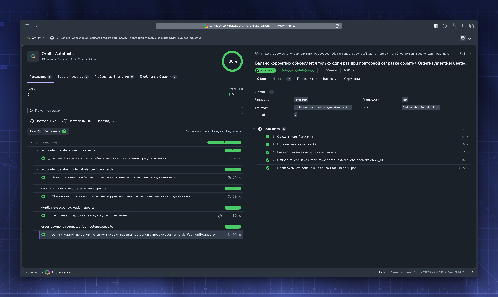

Автотесты для основных E2E-сценариев платформы Orbita Market.

🛰️ ✨ Ссылка: [orbita-market-allure-report.s3-website.cloud.ru](https://orbita-market-allure-report.s3-website.cloud.ru/)

## Технологии

| Технология                                    | Роль                                     |
| --------------------------------------------- | ---------------------------------------- |
| [TypeScript](https://www.typescriptlang.org/) | Язык написания тестов                    |
| [Jest](https://jestjs.io/)                    | Тест-раннер                              |
| [Allure](https://allurereport.org/)           | Генерация отчёта о прохождении тестов    |
| [Axios](https://axios-http.com/)              | HTTP-клиент для обращений к REST API     |
| [KafkaJS](https://kafka.js.org/)              | Клиент для взаимодействия с Apache Kafka |
| [@faker-js/faker](https://fakerjs.dev/)       | Генерация тестовых данных                |

## Предварительные требования

- Node.js: 18+
- Работающий экземпляр приложения Orbita Market

## Переменные окружения

> Можно задать в файле `.env` либо передать непосредственно в команде запуска.

| Переменная        | По умолчанию            | Описание                            |
| ----------------- | ----------------------- | ----------------------------------- |
| `ORBITA_BASE_URL` | `http://localhost:8080` | Базовый URL REST API приложения     |
| `KAFKA_BROKERS`   | `localhost:9092`        | Список брокеров Kafka через запятую |

## Установка зависимостей

```bash
npm install
```

## Запуск тестов

```bash
npm test
```

После выполнения всех тестов команда автоматически генерирует Allure-отчёт в директории `allure-report/`.

Запуск отдельного тестового файла:

```bash
npm test -- account-order-balance-flow
```

Альтернативный вариант — через скрипт-обёртку (устанавливает зависимости и запускает тесты):

```bash
./run.sh
```

## Просмотр отчёта

```bash
npm run report:open
```

Команда запустит локальный сервер и автоматически откроет `allure-report/index.html` в браузере.


